# Trabalho Final Mininet: Questão 1

## Criação da Topologia

Para emular uma topologia em árvore com profundidade 4 e ramificação 3, usando endereços MAC padronizados e enlaces de 35 Mbps, foi executado no shell do Mininet:

```bash
sudo mn --topo=tree,4,3 --link=tc,bw=35 --mac
```

- `--topo=tree,4,3` gera uma árvore com depth=4 e fanout=3.
- `--link=tc,bw=35` configura todos os enlaces com larura de banda de 35 Mbps.
- `--mac` fixa endereços MAC padronizados para facilitar a inspeção.

Isso já usa o controlador padrão do Mininet, portanto não é preciso especificar o `--controller`.

### Execução do comando

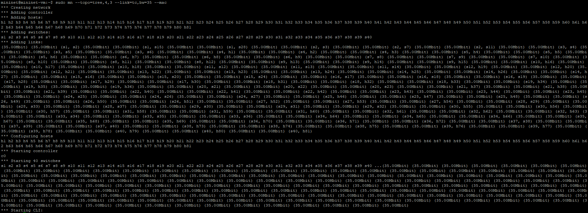

---

## Inspeção da Topologia

Após iniciar o Mininet, os seguintes comandos foram usados para obter uma visão geral dos nós, links, interfaces, IPs e MACs:

- Comando `nodes`.

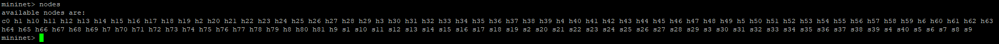

- Comando `net`.

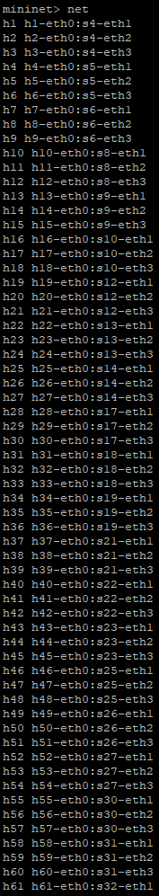
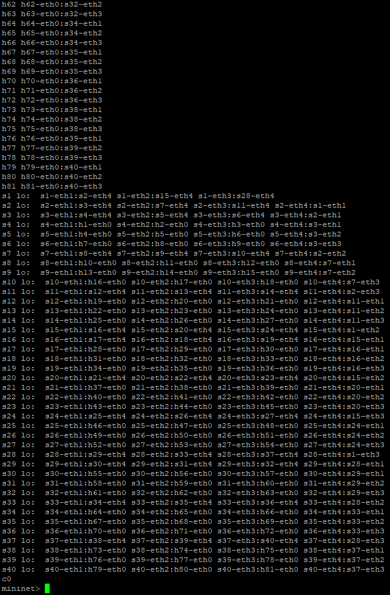

- Comando `dump`.

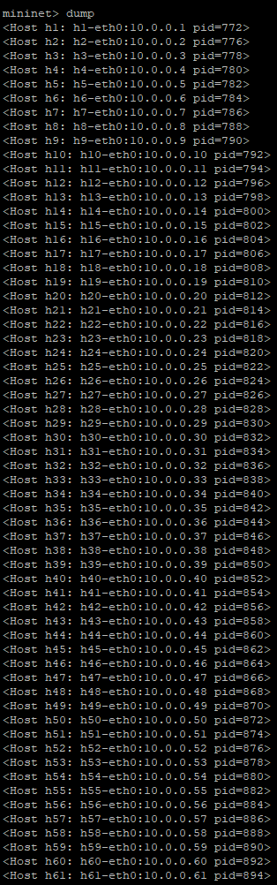
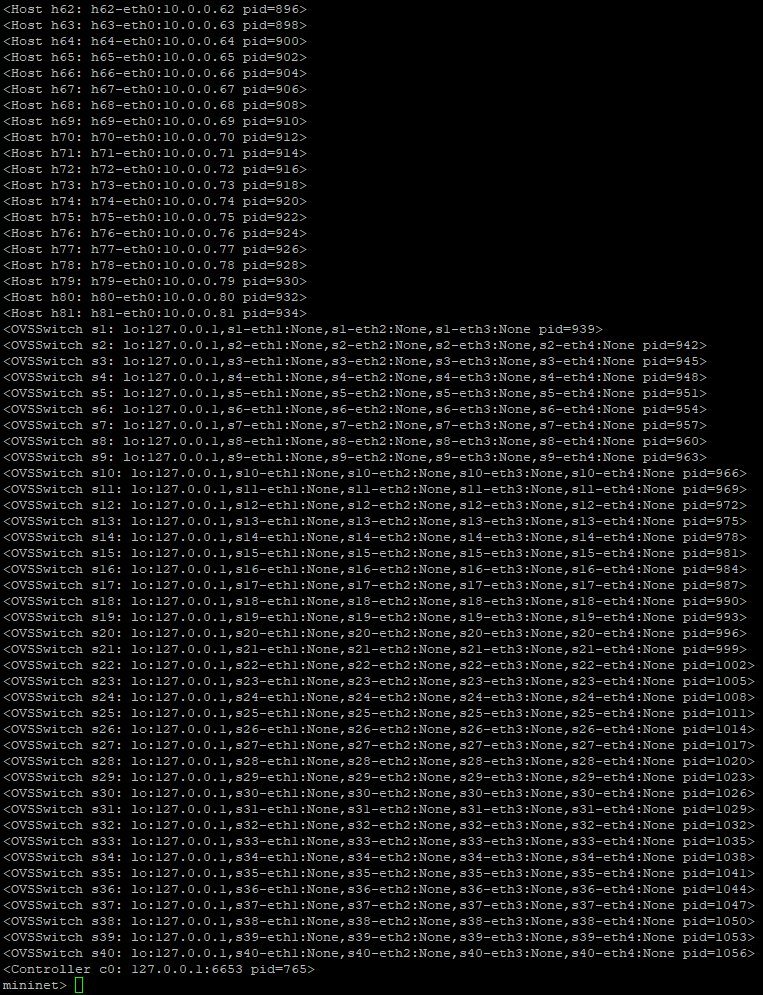

- Comando `intfs`.

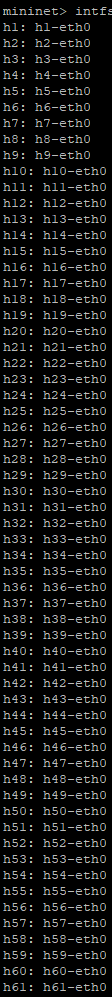
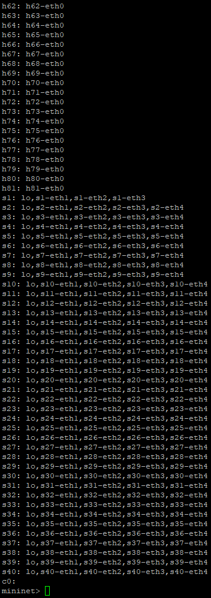

### Detalhamento em cada host

Para obter informações detalhadas em um host específico (por exmplo, h1), foi usado:

- Comando `h1 ifconfig -a`.

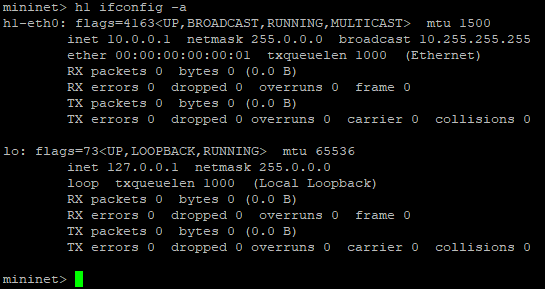

- Comando `h1 ip a`.

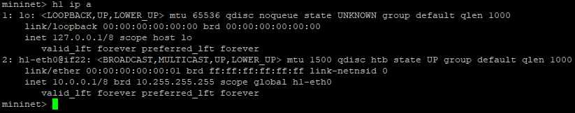

### Informações de portas nos switches

Para visualizar como os switches mapeiam portas e MACs:

- Comando `sh ovs-ofctl show s1`.

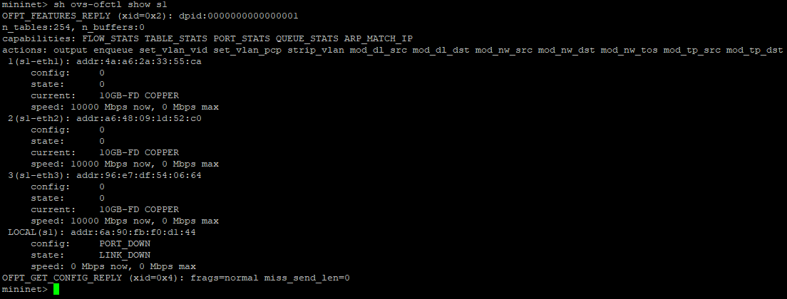

- Comando `sh ovs-dpctl show`.

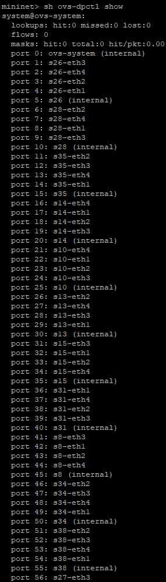
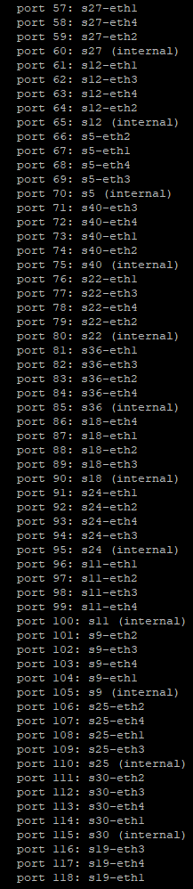
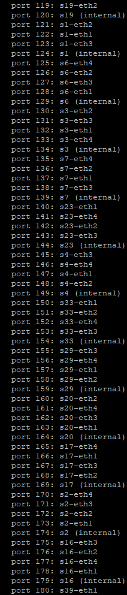
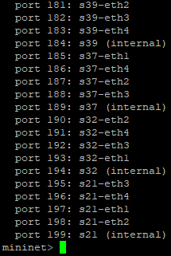

---

## Ilustração da Topologia


(Abra a imagem ou baixe para mais detalhes)

---

## Testes de Ping

Roda o `tcpdump` em background nos host 1 e 80:

```bash
h1 tcpdump -i h1-eth0 -n icmp &  
h80 tcpdump -i h80-eth0 -n icmp &
```

Executa o ping entre os dois hosts:

```bash
h1 ping -c 5 10.0.0.80
```

### Execução dos comandos

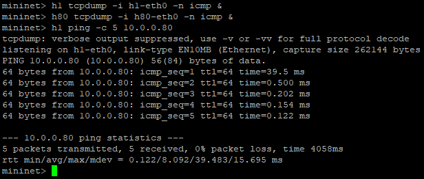

---

## Testes de Larguras de Bandas Diferêntes

Os seguintes comandos configuram o h1 como servidor TCP na porta 5555 e o h2 como cliente, com relatórios de banda a cada segundo durante 20 segundos.

### Iniciar o servidor do host 1

```bash
h1 iperf -s -p 5555 -i 1 &
```

- `s` define o modo do servidor como TCP.
- `p 5555` define a porta de escuta como 5555.
- `i 1` define o relatório de throughput a cada 1 segundo.
- `&` define a execução em background.

### Iniciar o cliente no host 2

```bash
h2 iperf -c 10.0.0.1 -p 5555 -t 20 -i 1
```

- `c 10.0.0.1` conecta ao IP do h1.
- `p 5555` define a porta de destino como 5555.
- `t 20` define a duração do teste de 20 segundos.
- `i 1` define a geração do relatório a cada 1 segundo.

#### Para 5 Mbps

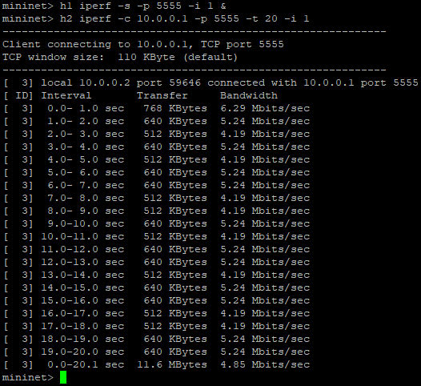

#### Para 10 Mbps

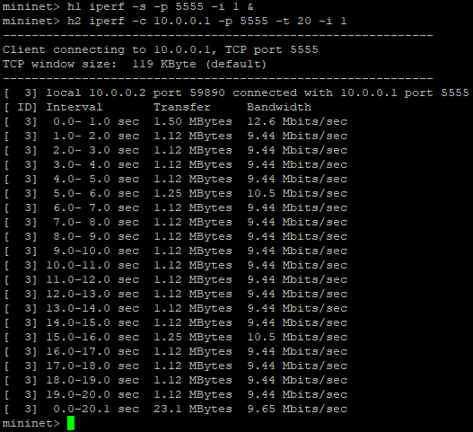

#### Para 25 Mbps

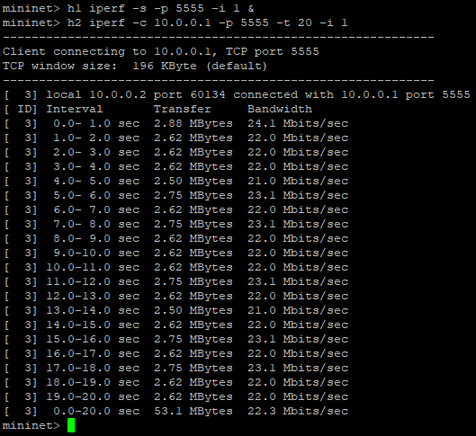

#### Para 35 Mbps

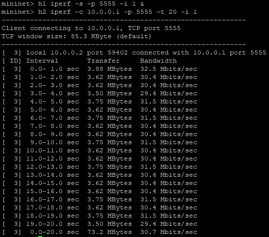
