# Trabalho Final Mininet: Questão 2

## Código Python para Topologia Customizada

Para a topologia customizada na imagem abaixo, foi feito o seguinte código:

### Topologia

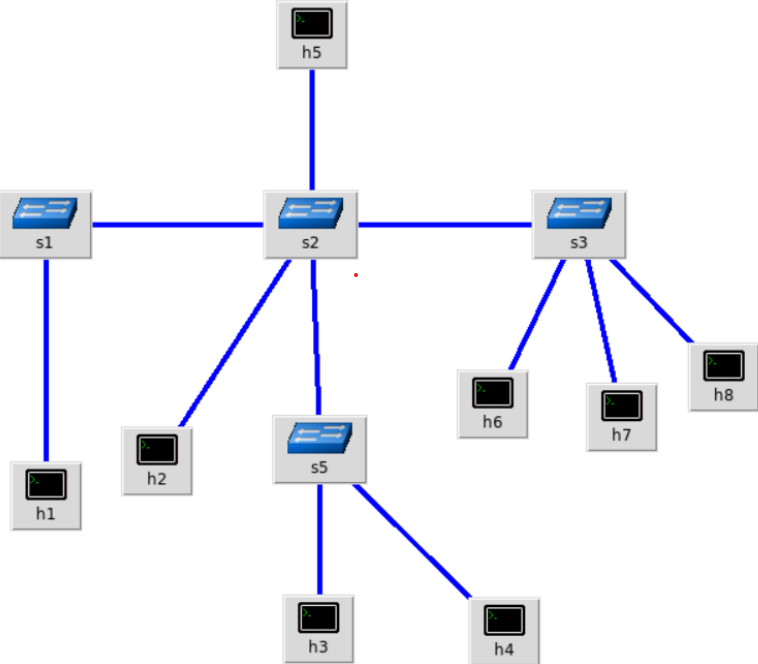

### Código Python

```python
from mininet.topo import Topo
from mininet.net import Mininet
from mininet.cli import CLI
from mininet.log import setLogLevel

class CustomTopo(Topo):
    def __init__(self):
        Topo.__init__(self)
        # Create hosts
        h1 = self.addHost('h1')
        h2 = self.addHost('h2')
        h3 = self.addHost('h3')
        h4 = self.addHost('h4')
        h5 = self.addHost('h5')
        h6 = self.addHost('h6')
        h7 = self.addHost('h7')
        h8 = self.addHost('h8')

        # Create switches
        s1 = self.addSwitch('s1')
        s2 = self.addSwitch('s2')
        s3 = self.addSwitch('s3')
        s5 = self.addSwitch('s5')

        # Add links
        self.addLink(s1, h1)
        self.addLink(s1, s2)

        self.addLink(s2, s3)
        self.addLink(s2, s5)
        self.addLink(s2, h2)
        self.addLink(s2, h5)

        self.addLink(s3, h6)
        self.addLink(s3, h7)
        self.addLink(s3, h8)

        self.addLink(s5, h3)
        self.addLink(s5, h4)

# Topologies dictionary for `mn --custom`
topos = {'customtopo': (lambda: CustomTopo())}

def run():
    topo = CustomTopo()
    net = Mininet(topo=topo)
    net.start()
    print("\n*** Topologia customizada ativa\n")
    CLI(net)
    net.stop()

if __name__ == '__main__':
    setLogLevel('info')
    run()
```

Ou pode ser visto no arquivo .py [custom_topo.py](./codes/custom_topo.py)

---

## Criação da Topologia

Para criar a topologia customizada foi executado o seguinte comando:

```bash
sudo mn --custom custom_topo.py --topo customtopo --mac --controller=none
```

- `--custom custom_topo.py` carrega o script Python coms classe CustomTopo.
- `--topo customtopo` indica a topologia registrada no dicionário `topos`.
- `--mac` atríbui endereços MAC padronizados.
- `--controller=none` não levanta nenhum controller.

### Execução do comando

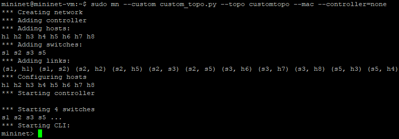

---

## Inspeção da Topologia

Após iniciar o Mininet, os seguintes comandos foram usados para obter uma visão geral dos nós, links, interfaces, IPs e MACs:

- Comando `nodes`.

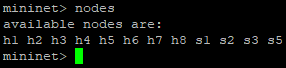

- Comando `net`.

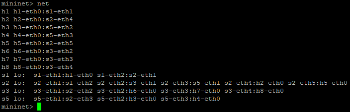

- Comando `dump`.

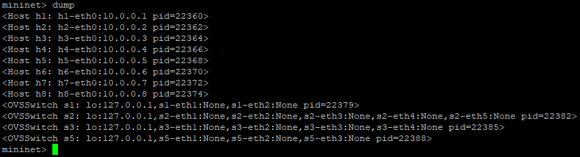

- Comando `intfs`.

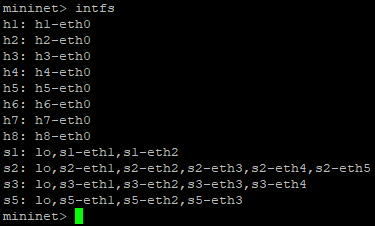

### Detalhamento em cada host

Para obter informações detalhadas em um host específico (por exmplo, h1), foi usado:

- Comando `h1 ifconfig -a`.

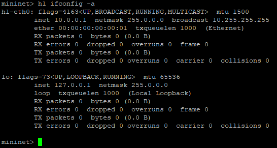

- Comando `h1 ip a`.

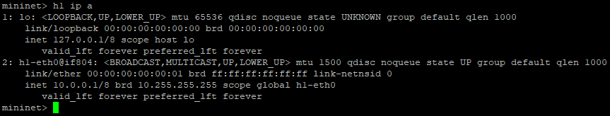

### Informações de portas nos switches

Para visualizar como os switches mapeiam portas e MACs:

- Comando `sh ovs-ofctl show s1`.

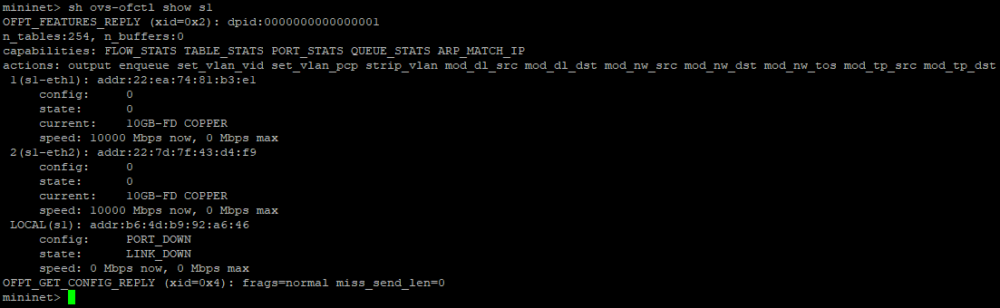

- Comando `sh ovs-dpctl show`.

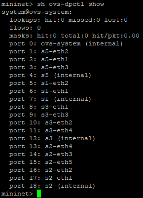

---

## Ilustração da Topologia

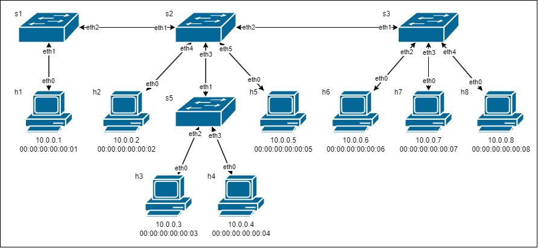

(Abra a imagem ou baixe para mais detalhes)

---

## Testes de Ping

O comando `pingall` testa pings entre todos os pares de hosts da topologia. Como pode se ver na imagem abaixo, nenhum teste ocorreu com sucesso, já que o controller foi definido como `none`.

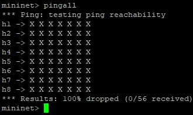

---

## Regras baseadas em Endereços MAC

Para criar manualmente regras de fluxo baseadas em MAC e permitir comunicação entre os nós.

### Apagar todas as regras existentes

O comando abaixo garante que não haja regras "fantasmas" no switch 1.

```bash
sh ovs-ofctl del-flows s1
```

Deve alterar o valor de `s1` para os outros switches.

#### Execução do comando para todos os switches

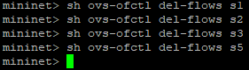

### Descobrir portas de saída

Usando o comando `ovs-ofctl show` visto acima é possível ver as portas relacionadas ao switch especificado. No exemplo foi especificado o switch 1.

### Adicionar regras MAC para os hosts

Como são diversos hostsde origem e de destino. Sómente foi feito as regras para os hosts 1 e 2.

```bash
sh ovs-ofcli add-flow s1 dl_src=00:00:00:00:00:01,dl_dst=00:00:00:00:00:02,actions=output:2
sh ovs-ofcli add-flow s2 dl_src=00:00:00:00:00:01,dl_dst=00:00:00:00:00:02,actions=output:4
sh ovs-ofcli add-flow s2 dl_src=00:00:00:00:00:02,dl_dst=00:00:00:00:00:01,actions=output:1
sh ovs-ofcli add-flow s1 dl_src=00:00:00:00:00:02,dl_dst=00:00:00:00:00:01,actions=output:1
```

Hábilita o tráfego de dados ARP:

```bash
sh ovs-ofctl add-flow s1 dl_type=0x806,nw_proto=1,action=flood
sh ovs-ofctl add-flow s2 dl_type=0x806,nw_proto=1,action=flood
```

---

## Testes de Ping para as Novas Regras

Para o teste de ping foi utilizado o comando `ping` de `h1` para `h2`.

```bash
h1 ping -c 5 h2
```

### Execução do comando ping

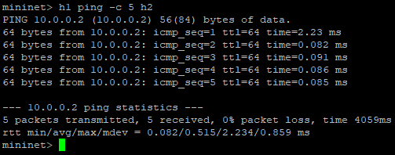
