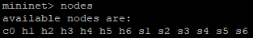
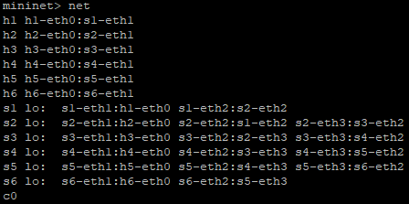
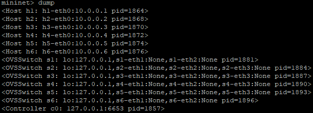
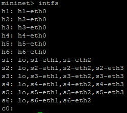
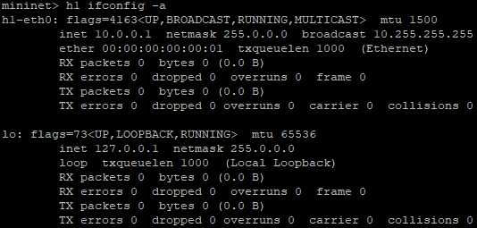
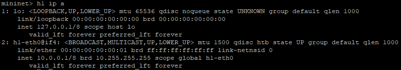
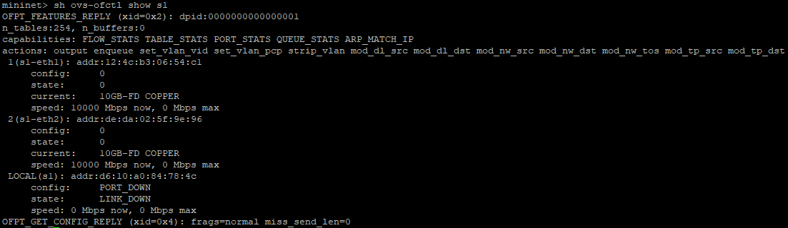
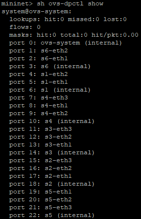
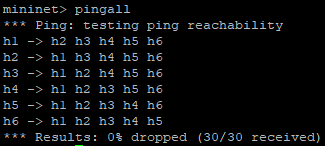
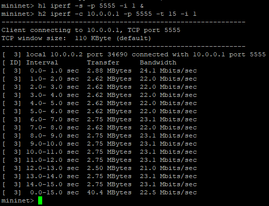

# Trabalho Mininet 1

## Criando a rede

Para emular a topologia linear com 6 switchs, usando endereços MAC padronizados e enlaces de 25 Mbps, foi executado no shell do Mininet:
```bash
sudo mn --topo=linear,6 --link=tc,bw=25 --mac
```

- `--topo=linear,6` cria 6 switches em linha, cada um com um host conectado.
- `--link=tc,bw=25` configura todos os enlaces com larura de banda de 25 Mbps.
- `--mac` fixa endereços MAC padronizados para facilitar a inspeção.

Isso já usa o controlador padrão do Mininet, portanto não é preciso especificar o `--controller`.

#### Execução do comando


---

## Inspeção geral da topologiaa

Após iniciar o Mininet, os seguintes comandos foram usados para obter uma visão geral dos nós, links, interfaces, IPs e MACs:

- Comando `nodes`.


- Comando `net`.


- Comando `dump`.


- Comando `intfs`.


### Detalhamento em cada host

Para obter informações detalhadas em um host específico (por exmplo, h1), foi usado: 

- Comando `h1 ifconfig -a`.



- Comando `h1 ip a`.



### Informações de portas nos switches

Para visualizar como os switches mapeiam portas e MACs:

- Comando `sh ovs-ofctl show s1`.



- Comando `sh ovs-dpctl show`.



---

## Teste de Ping

O comando `pingall` testa pings entre toos os pares de hosts da topologia.



---

## Configuração do servidor TCP com iperf

Os seguintes comandos configuram o h1 como servidor TCP na porta 5555 e o h2 como cliente, com relatórios de banda a cada segundo durante 15 segundos.

### Iniciar o servidor do host 1

```bash
h1 iperf -s -p 5555 -i 1 &
```

- `-s` define o modo do servidor como TCP.
- `-p 5555` define a porta de escuta como 5555.
- `-i 1` define o relatório de throughput a cada 1 segundo.
- `&` define a execução em background.

### Iniciar o cliente no host 2

```bash
h2 iperf -c 10.0.0.1 -p 5555 -t 15 -i 1
```

- `-c 10.0.0.1` conecta ao IP do h1.
- `-p 5555` define a porta de destino como 5555.
- `-t 15` define a duração do teste de 15 segundos.
- `-i 1` define a geração do relatório a cada 1 segundo.

#### Execução dos comandos

